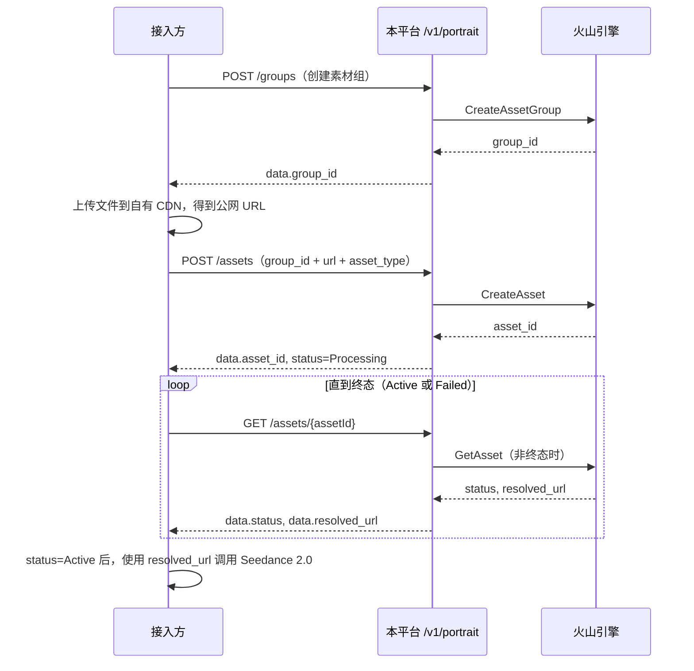

# 人像库 API 接口文档

> 适用场景：火山引擎人像库（Ark OpenAPI）素材组 / 素材管理，供 **Seedance 2.0** 等能力在生成前完成素材注册与审核状态查询。  
> 面向对象：接入方开发 / 测试人员（客户试用交付文档）。

---

## 目录

1. [概述](#1-概述)
2. [接入准备](#2-接入准备)
3. [通用约定](#3-通用约定)
4. [接口一览](#4-接口一览)
5. [接口详情](#5-接口详情)
   - [5.1 创建素材组](#51-创建素材组)
   - [5.2 查询素材组列表](#52-查询素材组列表)
   - [5.3 更新素材组](#53-更新素材组)
   - [5.4 创建素材（注册 URL）](#54-创建素材注册-url)
   - [5.5 查询素材列表](#55-查询素材列表)
   - [5.6 查询单个素材详情（含审核状态刷新）](#56-查询单个素材详情含审核状态刷新)
   - [5.7 更新素材](#57-更新素材)
6. [审核状态说明](#6-审核状态说明)
7. [推荐调用流程](#7-推荐调用流程)
8. [错误与排查](#8-错误与排查)
9. [附录：数据模型字段](#9-附录数据模型字段)

---

## 1. 概述

### 1.1 能力说明

本平台对火山引擎人像库提供 **HTTP REST 封装**，在服务端使用 AK/SK 调用 Ark OpenAPI，并完成：

| 能力 | 说明 |
|------|------|
| 素材组管理 | 创建、查询、更新素材组；按**登录用户账号**隔离 |
| 素材管理 | 向指定素材组提交**公网 URL**（图片 / 视频 / 音频），查询状态，更新名称 |
| 状态同步 | 单条查询时**实时**请求火山刷新；后台另每 **5 分钟**轮询非终态素材 |

### 1.2 重要限制（接入前必读）

| 项 | 说明 |
|----|------|
| **不提供文件上传** | 平台**不代理** multipart 上传。须先将文件放到自有 OSS/CDN，再调用「创建素材」传入 **HTTPS 公网 URL** |
| **数据隔离维度** | 素材组、素材列表均按 **用户账号** 隔离，与具体哪把 API Key 无关（同账号下多把 Key 看到的数据相同） |
| **路径参数中的 ID** | 路径参数 `:assetId` 为火山返回的 `asset_id`；`:groupId` 为火山返回的 `group_id`，**不是**本地自增字段 `id` |
| **计费** | 人像库接口本身不走 Relay 渠道计费 |

### 1.3 Base URL

```text
https://api.mapi.zone/v1/portrait/...
```

下文示例统一使用正式域名：`https://api.mapi.zone`

---

## 2. 接入准备

### 2.1 获取 API Token

在平台控制台创建 **API 令牌**，记下完整 Key（常见形态：`sk-xxxxxxxx`）。

### 2.2 请求头

所有接口均需携带：

| Header | 必填 | 说明 |
|--------|------|------|
| `Authorization` | 是 | `Bearer {token}` |
| `Content-Type` | POST / PUT 时建议 | `application/json` |

---

## 3. 通用约定

### 3.1 统一响应结构

所有接口返回 **HTTP 200**，通过 `success` 字段区分成功 / 失败：

**成功：**

```json
{
  "success": true,
  "message": "",
  "data": { ... }
}
```

**失败：**

```json
{
  "success": false,
  "message": "人类可读的错误说明"
}
```

> 注意：HTTP 状态码始终为 `200`，业务错误通过 `success: false` + `message` 体现。`401` / `403` 由认证中间件在鉴权层返回，不属于业务错误响应。

### 3.2 分页参数（列表接口通用）

| Query 参数 | 类型 | 默认值 | 说明 |
|-----------|------|--------|------|
| `p` | integer | 1 | 页码，从 1 开始 |
| `page_size` | integer | 20 | 每页数量，最大 100 |

分页响应结构（`data` 字段内）：

```json
{
  "page": 1,
  "page_size": 20,
  "total": 55,
  "items": [ ... ]
}
```

### 3.3 时间格式

`created_at`、`updated_at` 为 JSON 序列化的 **RFC3339** 时间字符串，例如：`2026-05-20T18:12:05.09398+08:00`

### 3.4 枚举大小写

- `asset_type` 必须为 **`Image`**、**`Video`**、**`Audio`**（首字母大写，与火山一致）
- `group_type` 不传时服务端默认 **`AIGC`**
- `status` 枚举见 [第 6 节](#6-审核状态说明)

---

## 4. 接口一览

| 序号 | 方法 | 路径 | 说明 |
|------|------|------|------|
| 1 | `POST` | `/v1/portrait/groups` | 创建素材组 |
| 2 | `GET` | `/v1/portrait/groups` | 查询当前用户的素材组列表（分页） |
| 3 | `PUT` | `/v1/portrait/groups/{groupId}` | 更新素材组名称 / 描述 |
| 4 | `POST` | `/v1/portrait/assets` | 向素材组注册素材 URL |
| 5 | `GET` | `/v1/portrait/assets` | 查询当前用户的素材列表（分页，可按组过滤） |
| 6 | `GET` | `/v1/portrait/assets/{assetId}` | 查询单条素材详情；非终态时实时刷新火山状态 |
| 7 | `PUT` | `/v1/portrait/assets/{assetId}` | 更新素材名称 |

---

## 5. 接口详情

---

### 5.1 创建素材组

在火山引擎侧创建素材组，并为**当前用户**落库一条映射记录。

#### 基本信息

| 项 | 值 |
|----|-----|
| **Method** | `POST` |
| **Path** | `/v1/portrait/groups` |
| **认证** | 需要 `Authorization` |

#### 请求体（JSON）

| 字段 | 类型 | 必填 | 说明 |
|------|------|------|------|
| `name` | string | **是** | 素材组名称，首尾空格会被剔除，不能为空 |
| `description` | string | 否 | 素材组描述 |
| `group_type` | string | 否 | 素材组类型；**不传时默认 `AIGC`** |

#### 请求示例

```bash
curl -X POST 'https://api.mapi.zone/v1/portrait/groups' \
  -H 'Authorization: Bearer sk-your-token' \
  -H 'Content-Type: application/json' \
  -d '{
    "name": "Seedance-角色素材组-01",
    "description": "用于 2.0 试用的角色参考图",
    "group_type": "AIGC"
  }'
```

#### 成功响应

```json
{
  "success": true,
  "message": "",
  "data": {
    "group_id": "ag-7f3c2b1a9e8d4c6f",
    "name": "Seedance-角色素材组-01",
    "id": 12
  }
}
```

| 字段 | 类型 | 说明 |
|------|------|------|
| `group_id` | string | **火山素材组 ID**（后续创建素材、过滤列表时使用此值） |
| `name` | string | 素材组名称 |
| `id` | integer | 本平台本地自增 ID（仅内部关联，不用于路径参数） |

#### 失败示例

```json
{ "success": false, "message": "素材组名称不能为空" }
{ "success": false, "message": "调用火山引擎失败: [InvalidParameter] xxx" }
```

---

### 5.2 查询素材组列表

返回**当前用户**在本平台登记过的全部素材组，按 `created_at` 降序，支持分页。

> 数据来自本地库，不实时调用火山。

#### 基本信息

| 项 | 值 |
|----|-----|
| **Method** | `GET` |
| **Path** | `/v1/portrait/groups` |
| **认证** | 需要 `Authorization` |

#### Query 参数

| 参数 | 类型 | 默认值 | 说明 |
|------|------|--------|------|
| `p` | integer | 1 | 页码 |
| `page_size` | integer | 20 | 每页数量，最大 100 |

#### 请求示例

```bash
curl 'https://api.mapi.zone/v1/portrait/groups?p=1&page_size=20' \
  -H 'Authorization: Bearer sk-your-token'
```

#### 成功响应

```json
{
  "success": true,
  "message": "",
  "data": {
    "page": 1,
    "page_size": 20,
    "total": 3,
    "items": [
      {
        "id": 12,
        "user_id": 1001,
        "remote_group_id": "ag-7f3c2b1a9e8d4c6f",
        "name": "Seedance-角色素材组-01",
        "project_name": "",
        "created_at": "2026-05-20T10:00:00+08:00",
        "updated_at": "2026-05-20T10:00:00+08:00"
      }
    ]
  }
}
```

**`items[]` 字段说明：**

| 字段 | 类型 | 说明 |
|------|------|------|
| `id` | integer | 本平台本地自增 ID |
| `user_id` | integer | 所属用户 ID |
| `remote_group_id` | string | 火山素材组 ID（路径参数 `:groupId` 即此值） |
| `name` | string | 素材组名称 |
| `project_name` | string | 项目名称（由平台配置写入） |
| `created_at` | string | 创建时间 |
| `updated_at` | string | 更新时间 |

---

### 5.3 更新素材组

更新素材组的名称或描述（火山侧仅支持更新 `Name`、`Description`）。

#### 基本信息

| 项 | 值 |
|----|-----|
| **Method** | `PUT` |
| **Path** | `/v1/portrait/groups/{groupId}` |
| **Path 参数** | `groupId` = 火山素材组 ID（来自创建响应的 `group_id`） |
| **认证** | 需要 `Authorization` |

#### 请求体（JSON）

| 字段 | 类型 | 必填 | 说明 |
|------|------|------|------|
| `name` | string | 条件必填 | 新名称（最多 64 字符）；`name` 和 `description` 至少传一个 |
| `description` | string | 条件必填 | 新描述（最多 300 字符）；`name` 和 `description` 至少传一个 |

#### 请求示例

```bash
curl -X PUT 'https://api.mapi.zone/v1/portrait/groups/ag-7f3c2b1a9e8d4c6f' \
  -H 'Authorization: Bearer sk-your-token' \
  -H 'Content-Type: application/json' \
  -d '{
    "name": "Seedance-主角素材组",
    "description": "更新后的描述"
  }'
```

#### 成功响应

```json
{
  "success": true,
  "message": "",
  "data": {
    "group_id": "ag-7f3c2b1a9e8d4c6f",
    "name": "Seedance-主角素材组"
  }
}
```

#### 失败示例

```json
{ "success": false, "message": "素材组不存在" }
{ "success": false, "message": "name 或 description 至少传一个" }
```

---

### 5.4 创建素材（注册 URL）

向指定火山素材组提交一个**公网 URL**，由火山拉取文件并进入审核流程。创建成功后本地状态初始为 **`Processing`**。

#### 基本信息

| 项 | 值 |
|----|-----|
| **Method** | `POST` |
| **Path** | `/v1/portrait/assets` |
| **认证** | 需要 `Authorization` |

#### 请求体（JSON）

| 字段 | 类型 | 必填 | 说明 |
|------|------|------|------|
| `group_id` | string | **是** | 火山素材组 ID（来自创建素材组的 `group_id`） |
| `url` | string | **是** | 素材文件的 **公网 HTTPS URL**；平台不转存，直接传给火山 |
| `asset_type` | string | **是** | 素材类型，仅允许：`Image`、`Video`、`Audio` |
| `name` | string | 否 | 素材展示名称（最多 64 字符） |

#### URL 要求

| 要求 | 说明 |
|------|------|
| 可公网访问 | 火山服务器须能直接 GET 该 URL |
| 建议 HTTPS | 避免明文传输与防盗链导致拉取失败 |
| 不能是内网地址 | `127.0.0.1`、`10.x`、`192.168.x` 等无效 |

#### 请求示例

```bash
curl -X POST 'https://api.mapi.zone/v1/portrait/assets' \
  -H 'Authorization: Bearer sk-your-token' \
  -H 'Content-Type: application/json' \
  -d '{
    "group_id": "ag-7f3c2b1a9e8d4c6f",
    "url": "https://cdn.example.com/portrait/ref-001.jpg",
    "asset_type": "Image",
    "name": "主角正面照"
  }'
```

#### 成功响应

```json
{
  "success": true,
  "message": "",
  "data": {
    "id": 88,
    "asset_id": "asset-20260520181205-vvds9",
    "remote_group_id": "ag-7f3c2b1a9e8d4c6f",
    "status": "Submitted"
  }
}
```

| 字段 | 类型 | 说明 |
|------|------|------|
| `id` | integer | 本平台本地自增 ID |
| `asset_id` | string | **火山素材 ID**（查询详情、Seedance 引用时使用此值） |
| `remote_group_id` | string | 所属火山素材组 ID |
| `status` | string | 初始为 **`Submitted`** |

#### 失败示例

```json
{ "success": false, "message": "asset_type 须为 Image / Video / Audio" }
{ "success": false, "message": "group_id 不能为空" }
```

---

### 5.5 查询素材列表

返回**当前用户**的素材记录，支持分页和按素材组过滤。数据来自本地库（含后台轮询已更新的状态），**不逐条**调用火山。

#### 基本信息

| 项 | 值 |
|----|-----|
| **Method** | `GET` |
| **Path** | `/v1/portrait/assets` |
| **认证** | 需要 `Authorization` |

#### Query 参数

| 参数 | 类型 | 必填 | 说明 |
|------|------|------|------|
| `group_id` | string | 否 | 火山素材组 ID；传入时只返回该组素材 |
| `p` | integer | 否 | 页码，默认 1 |
| `page_size` | integer | 否 | 每页数量，默认 20，最大 100 |

#### 请求示例

```bash
# 全部素材（第 1 页，每页 20 条）
curl 'https://api.mapi.zone/v1/portrait/assets?p=1&page_size=20' \
  -H 'Authorization: Bearer sk-your-token'

# 按素材组过滤
curl 'https://api.mapi.zone/v1/portrait/assets?group_id=ag-7f3c2b1a9e8d4c6f&p=1&page_size=10' \
  -H 'Authorization: Bearer sk-your-token'
```

#### 成功响应

```json
{
  "success": true,
  "message": "",
  "data": {
    "page": 1,
    "page_size": 20,
    "total": 5,
    "items": [
      {
        "id": 88,
        "user_id": 1001,
        "remote_group_id": "ag-7f3c2b1a9e8d4c6f",
        "remote_asset_id": "asset-20260520181205-vvds9",
        "name": "主角正面照",
        "asset_type": "Image",
        "source_url": "https://cdn.example.com/portrait/ref-001.jpg",
        "status": "Active",
        "resolved_url": "https://ark-media-asset.tos-cn-beijing.volces.com/...",
        "created_at": "2026-05-20T18:12:05.09398+08:00",
        "updated_at": "2026-05-20T18:14:01.609274032+08:00"
      }
    ]
  }
}
```

**`items[]` 字段说明：**

| 字段 | 类型 | 说明 |
|------|------|------|
| `id` | integer | 本平台本地自增 ID |
| `user_id` | integer | 所属用户 ID |
| `remote_group_id` | string | 火山素材组 ID |
| `remote_asset_id` | string | 火山素材 ID（即路径参数 `:assetId`） |
| `name` | string | 素材名称 |
| `asset_type` | string | `Image` / `Video` / `Audio` |
| `source_url` | string | 创建时提交的原始 URL |
| `status` | string | 审核状态，见 [第 6 节](#6-审核状态说明) |
| `resolved_url` | string | 火山解析后的可用 URL；`Active` 前可能为空 |
| `created_at` | string | 创建时间 |
| `updated_at` | string | 最后更新时间 |

---

### 5.6 查询单个素材详情（含审核状态刷新）

根据火山素材 ID 查询一条素材。行为取决于当前状态：

| 本地 `status` | 行为 |
|---------------|------|
| 终态：`Active`、`Failed` | 直接返回本地数据，**不调**火山 |
| 非终态：如 `Processing` | **实时调用**火山 `GetAsset`，更新本地后返回最新状态 |

#### 基本信息

| 项 | 值 |
|----|-----|
| **Method** | `GET` |
| **Path** | `/v1/portrait/assets/{assetId}` |
| **Path 参数** | `assetId` = 火山素材 ID（创建响应的 `asset_id`，或列表中的 `remote_asset_id`） |
| **认证** | 需要 `Authorization` |

#### 请求示例

```bash
curl 'https://api.mapi.zone/v1/portrait/assets/asset-20260520181205-vvds9' \
  -H 'Authorization: Bearer sk-your-token'
```

#### 成功响应（`data` 字段）

| 字段 | 类型 | 说明 |
|------|------|------|
| `asset_id` | string | 火山素材 ID |
| `status` | string | 当前审核状态 |
| `resolved_url` | string | 火山审核通过后的可用 URL；`Active` 前可能为空 |
| `name` | string | 素材名称 |
| `asset_type` | string | 素材类型 |
| `source_url` | string | 创建时提交的原始 URL |
| `created_at` | string | 创建时间 |
| `updated_at` | string | 更新时间 |
| `refresh_error` | string | **仅在**非终态且实时刷新火山**失败**时出现；其余字段仍为本地缓存 |

#### 成功响应示例（审核通过）

```json
{
  "success": true,
  "message": "",
  "data": {
    "asset_id": "asset-20260520181205-vvds9",
    "status": "Active",
    "resolved_url": "https://ark-media-asset.tos-cn-beijing.volces.com/...",
    "name": "主角正面照",
    "asset_type": "Image",
    "source_url": "https://cdn.example.com/portrait/ref-001.jpg",
    "created_at": "2026-05-20T18:12:05.09398+08:00",
    "updated_at": "2026-05-20T18:14:01.609274032+08:00"
  }
}
```

#### 成功响应示例（处理中）

```json
{
  "success": true,
  "message": "",
  "data": {
    "asset_id": "asset-20260520181205-vvds9",
    "status": "Processing",
    "resolved_url": "",
    "name": "主角正面照",
    "asset_type": "Image",
    "source_url": "https://cdn.example.com/portrait/ref-001.jpg",
    "created_at": "2026-05-20T18:12:05.09398+08:00",
    "updated_at": "2026-05-20T18:12:10.000000000+08:00"
  }
}
```

#### 成功响应示例（火山刷新失败，仍返回本地缓存）

```json
{
  "success": true,
  "message": "",
  "data": {
    "asset_id": "asset-20260520181205-vvds9",
    "status": "Processing",
    "resolved_url": "",
    "name": "主角正面照",
    "asset_type": "Image",
    "source_url": "https://cdn.example.com/portrait/ref-001.jpg",
    "refresh_error": "请求火山引擎失败: timeout",
    "created_at": "2026-05-20T18:12:05.09398+08:00",
    "updated_at": "2026-05-20T18:12:05.09398+08:00"
  }
}
```

#### 失败示例

```json
{ "success": false, "message": "素材不存在" }
```

---

### 5.7 更新素材

更新素材名称（火山仅支持更新 `Name`）。

#### 基本信息

| 项 | 值 |
|----|-----|
| **Method** | `PUT` |
| **Path** | `/v1/portrait/assets/{assetId}` |
| **Path 参数** | `assetId` = 火山素材 ID |
| **认证** | 需要 `Authorization` |

#### 请求体（JSON）

| 字段 | 类型 | 必填 | 说明 |
|------|------|------|------|
| `name` | string | **是** | 新的素材名称，首尾空格会被剔除，不能为空（最多 64 字符） |

#### 请求示例

```bash
curl -X PUT 'https://api.mapi.zone/v1/portrait/assets/asset-20260520181205-vvds9' \
  -H 'Authorization: Bearer sk-your-token' \
  -H 'Content-Type: application/json' \
  -d '{ "name": "主角正面照（修正版）" }'
```

#### 成功响应

```json
{
  "success": true,
  "message": "",
  "data": {
    "asset_id": "asset-20260520181205-vvds9",
    "name": "主角正面照（修正版）"
  }
}
```

#### 失败示例

```json
{ "success": false, "message": "素材不存在" }
{ "success": false, "message": "name 不能为空" }
```

---

## 6. 审核状态说明

### 6.1 状态枚举

| 状态值 | 含义 | 是否终态 |
|--------|------|----------|
| `Submitted` | 已提交，火山排队中（创建后初始状态） | 否 |
| `Processing` | 火山处理 / 审核中 | 否 |
| `Active` | 审核通过，`resolved_url` 可用 | **是** |
| `Failed` | 处理失败（URL 不可达、格式不符、审核拒绝等） | **是** |

> 终态定义：`Active`、`Failed`。处于终态时，单条查询接口不再实时调用火山。  
> `Submitted` 和 `Processing` 均为非终态，平台会持续轮询刷新。  
> 注：官方 `ListAssets` 过滤参数仅支持 `Active / Processing / Failed`（不含 `Submitted`），但 `Submitted` 是 CreateAsset 后真实存在的初始状态。

### 6.2 状态更新来源

| 机制 | 触发时机 | 说明 |
|------|----------|------|
| 单条查询 `GET .../assets/:assetId` | 调用时即时 | 非终态时实时调用火山 `GetAsset` 并写库 |
| 后台轮询 | 每 **5 分钟** | 扫描所有非终态素材并刷新；列表接口读到的是已落库结果 |

### 6.3 接入建议

1. 创建素材后，用 `GET /v1/portrait/assets/{assetId}` 轮询（建议间隔 3～10 秒）直到 `status` 为终态。
2. 仅展示列表时，用 `GET /v1/portrait/assets` 即可，依赖后台 5 分钟同步。
3. 调用 Seedance 2.0 前确认 `status === "Active"`，并使用 `resolved_url`。

---

## 7. 推荐调用流程



### 7.1 最小可行步骤（文字版）

1. `POST /v1/portrait/groups` → 保存 `data.group_id`  
2. 将素材上传至公网存储 → 得到 `https://...`  
3. `POST /v1/portrait/assets` → 保存 `data.asset_id`  
4. 循环 `GET /v1/portrait/assets/{asset_id}` 直至 `data.status` 为 `Active` / `Failed`  
5. `status = Active` 后，使用 `data.resolved_url` 发起视频生成  

---

## 8. 错误与排查

| 现象 | 可能原因 | 建议 |
|------|----------|------|
| `success: false`，Token 相关消息 | 未传 Authorization、Key 错误、过期、额度耗尽 | 检查控制台令牌状态与请求头格式 |
| `素材组名称不能为空` | `name` 全空格或未传 | 传非空 `name` |
| `group_id 不能为空` / `url 不能为空` | 必填字段缺失 | 检查 JSON 字段名与值 |
| `asset_type 须为 Image / Video / Audio` | 大小写或拼写错误 | 使用三种枚举之一 |
| `调用火山引擎失败` | 凭据错误、组 ID 无效、URL 火山无法拉取 | 联系平台管理员核查 `VOLC_PORTRAIT_*` 配置；自查 URL 公网可达性 |
| `素材不存在` | `assetId` 写错、用了本地 `id` 而非 `asset_id`、素材属其他用户 | 使用创建接口返回的 `data.asset_id` |
| 长期 `Processing` | 火山审核排队或 URL 拉取慢 | 继续轮询单条查询；检查 `refresh_error` 字段 |
| 列表状态滞后 | 列表不实时调火山 | 对关键素材用单条 `GET` 接口，或等待后台 5 分钟轮询 |
| `name 或 description 至少传一个` | 更新素材组时两个字段都为空 | 至少传一个非空字段 |

---

## 9. 附录：数据模型字段

### 9.1 ID 对照（易错）

| 业务称呼 | 接口字段名 | 用途 |
|----------|------------|------|
| 火山素材组 ID | `group_id`（创建组响应）/ `remote_group_id`（列表） | `POST /assets` 的 `group_id`；列表过滤 `?group_id=`；`PUT /groups/:groupId` 路径 |
| 火山素材 ID | `asset_id`（创建素材响应）/ `remote_asset_id`（列表） | `GET /assets/:assetId`；`PUT /assets/:assetId` 路径 |
| 本平台本地自增 ID | `id` | 仅本平台内部关联，**不要**用于路径参数或 `group_id` |

### 9.2 本地素材表关键字段（`PortraitAsset`）

| JSON 字段 | 类型 | 说明 |
|-----------|------|------|
| `id` | integer | 本地主键 |
| `user_id` | integer | 所属用户 ID |
| `remote_group_id` | string | 火山素材组 ID |
| `remote_asset_id` | string | 火山素材 ID |
| `name` | string | 名称 |
| `asset_type` | string | Image / Video / Audio |
| `source_url` | string | 提交的原始 URL |
| `status` | string | Processing / Active / Failed |
| `resolved_url` | string | 火山审核通过后的 URL |
| `created_at` | string | 创建时间 |
| `updated_at` | string | 更新时间 |

### 9.3 本地素材组表关键字段（`PortraitGroup`）

| JSON 字段 | 类型 | 说明 |
|-----------|------|------|
| `id` | integer | 本地主键 |
| `user_id` | integer | 所属用户 ID |
| `remote_group_id` | string | 火山素材组 ID |
| `name` | string | 素材组名称 |
| `project_name` | string | 项目名称 |
| `created_at` | string | 创建时间 |
| `updated_at` | string | 更新时间 |

---

## 文档修订

| 日期 | 说明 |
|------|------|
| 2026-05-20 | 初版：5 个接口、字段说明、示例与试用流程 |
| 2026-05-20 | v2：修正状态枚举（Active/Processing/Failed）；列表接口加分页；新增 PUT 更新接口 ×2；统一响应结构为 `{success, message, data}` |

如有接口变更，以实际部署版本为准；试用环境问题请联系平台技术支持并提供 `asset_id` / `group_id`。
